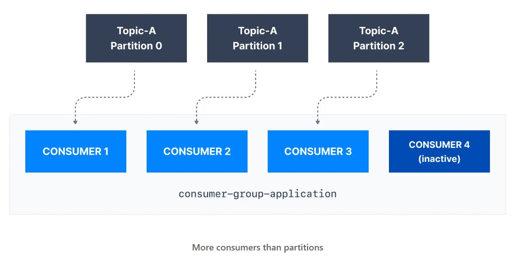

# Consumer Group

The benefit of leveraging a Kafka consumer group is that the consumers within the group will coordinate to split the work of reading from different partitions.

## More Consumers than Partitions 

If there are more consumers than the number of partitions of a topic, then some consumers will remain inactive as shown below. Usually, we have as many consumers in a consumer group as the number of partitions. If we want more consumers for higher throughput, we should create more partitions while creating the topic. Otherwise, some of the consumers may remain inactive.

