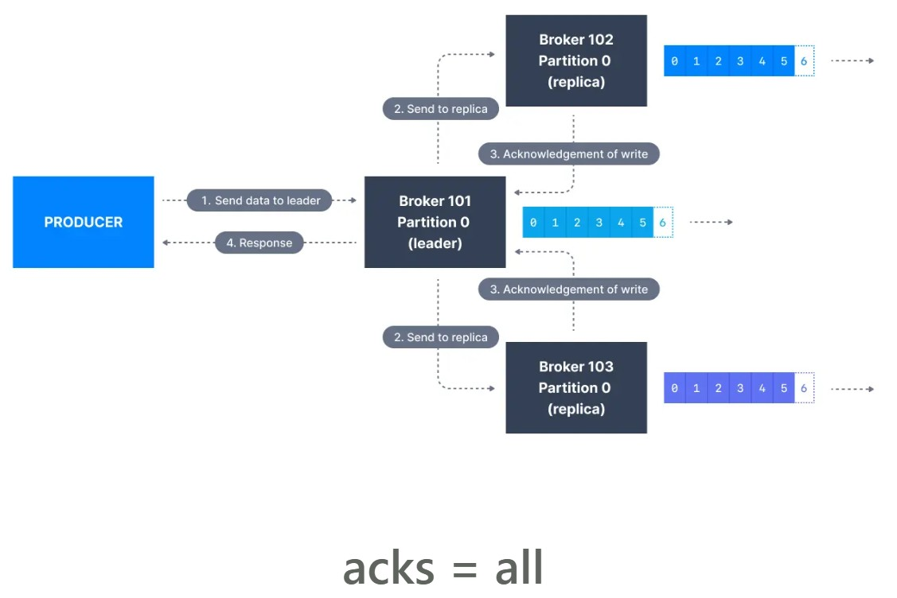

# Kafka Producer Message Acknowledgement

Kafka producers only write data to the current leader broker for a partition. **A Kafka producer configuration parameter called acks** which is the number of brokers who need to acknowledge receiving the message before it is considered a successful write.

Kafka producers must also specify a level of acknowledgment acks to specify if the message must be written to a minimum number of replicas before being considered a successful write.

> The default value of acks has changed with Kafka v3.0

> if using Kafka < v3.0, acks=1

> if using Kafka >= v3.0, acks=all

## acks=0

When acks=0 producers consider messages as "written successfully" the moment the message was sent without waiting for the broker to accept it at all.

This 'fire-and-forget' approach is only useful for scenarios where it is OK to potentially lose messages or data.

If the broker goes offline or an exception happens, we won’t know and will lose data. This is useful for data where it’s okay to potentially lose messages, such as metrics collection, and produces the highest throughput setting because the network overhead is minimized.

## acks = 1
When acks=1 , producers consider messages as "written successfully" when the message was acknowledged by only the leader.

The message receipt is only acknowledged by the leader in the Kafka replication setup.

**Leader response is requested, but replication is not a guarantee as it happens in the background. If an ack is not received, the producer may retry the request. If the leader broker goes offline unexpectedly but replicas haven’t replicated the data yet, we have a data loss.**

## acks = all
When acks=all, producers consider messages as "written successfully" when the message is accepted by all in-sync replicas (ISR).

> Popular Configuration
>  acks=all and min.insync.replicas=2 is the most popular option for data durability and availability and allows you to withstand at most the loss of one Kafka broker
