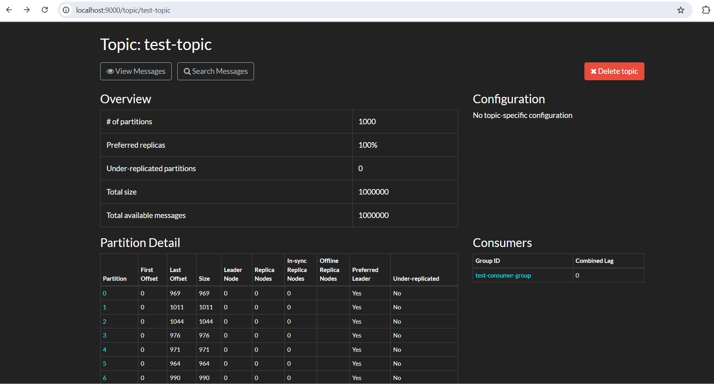
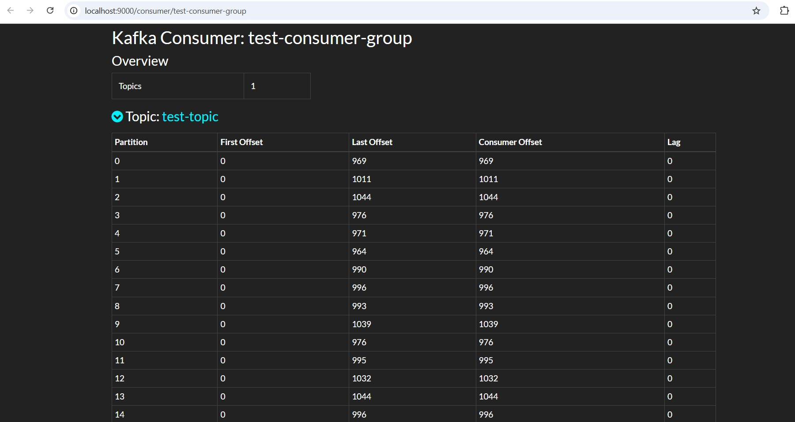

# Kafka Consumer Group

https://github.com/eMahtab/mastering-kafka/blob/main/kafka-basics/consumer-group.md

## Benefits of Kafka Consumer Group over individual consumers :

### Scalability

If you add more partitions or consumers, Kafka automatically balances the workload in a consumer group.

With individual consumers, you must manually distribute the workload.

### Fault Tolerance

If one consumer in a group fails, Kafka redistributes its partitions to the remaining consumers, ensuring continuous processing.

## Producer sending 1 Million messages to test-topic

```java
public class Producer {

    private static final String TOPIC = "test-topic";

    public static void startProducer() {
        Properties props = new Properties();
        props.put(ProducerConfig.BOOTSTRAP_SERVERS_CONFIG, "localhost:9092");
        props.put(ProducerConfig.KEY_SERIALIZER_CLASS_CONFIG, StringSerializer.class.getName());
        props.put(ProducerConfig.VALUE_SERIALIZER_CLASS_CONFIG, StringSerializer.class.getName());

        KafkaProducer<String, String> producer = new KafkaProducer<>(props);
        for (int i = 0; i < 1000_000; i++) {
            ProducerRecord<String, String> record = new ProducerRecord<>(TOPIC, "key" + i, "message" + i);
            producer.send(record, (metadata, exception) -> {
                if (exception == null) {
                    System.out.println("Sent: " + record.value() + " to partition " + metadata.partition());
                } else {
                    exception.printStackTrace();
                }
            });
        }
        producer.close();
    }
}
```

## Consumers in consumer group

```java
public class Consumer {

    private static final String TOPIC = "test-topic";

    public static void startConsumer() {
        Properties props = new Properties();
        props.put(ConsumerConfig.BOOTSTRAP_SERVERS_CONFIG, "localhost:9092");
        props.put(ConsumerConfig.GROUP_ID_CONFIG, "test-consumer-group");
        props.put(ConsumerConfig.KEY_DESERIALIZER_CLASS_CONFIG, StringDeserializer.class.getName());
        props.put(ConsumerConfig.VALUE_DESERIALIZER_CLASS_CONFIG, StringDeserializer.class.getName());
        props.put(ConsumerConfig.AUTO_OFFSET_RESET_CONFIG, "earliest");

        KafkaConsumer<String, String> consumer = new KafkaConsumer<>(props);
        consumer.subscribe(Collections.singletonList(TOPIC));

        while (true) {
            ConsumerRecords<String, String> records = consumer.poll(Duration.ofMillis(100));
            for (ConsumerRecord<String, String> record : records) {
                System.out.println(Thread.currentThread().getName() + " Consumed: " + record.value() + " from partition " + record.partition());
            }
        }
    }

}
```

### Main : Creating topic with 1000 partitions and starting 250 consumers (each as a separate thread) as a consumer group

```java
public class Main {

    private static final String TOPIC = "test-topic";
    private static final String BOOTSTRAP_SERVERS = "localhost:9092";
    private static final int NUMBER_OF_PARTITIONS = 1000;
    private static final int NUMBER_OF_CONSUMERS = 250;

    public static void main(String[] args) {
        createTopic();
        new Thread(Producer::startProducer).start();

        ExecutorService executorService = Executors.newFixedThreadPool(NUMBER_OF_CONSUMERS);
        for (int i = 1; i <= NUMBER_OF_CONSUMERS; i++) {
            executorService.submit(Consumer::startConsumer);
        }
    }

    private static void createTopic() {
        Properties config = new Properties();
        config.put(AdminClientConfig.BOOTSTRAP_SERVERS_CONFIG, BOOTSTRAP_SERVERS);

        try (AdminClient adminClient = AdminClient.create(config)) {
            NewTopic newTopic = new NewTopic(TOPIC, NUMBER_OF_PARTITIONS, (short) 1);
            adminClient.createTopics(Collections.singletonList(newTopic)).all().get();
            System.out.println("Topic created successfully!");
        } catch (Exception e) {
            System.out.println("Topic creation failed: " + e.getMessage());
        }
    }

}
```
### Topic with 1000 Partitions



### Consumer group with 250 Consumers


