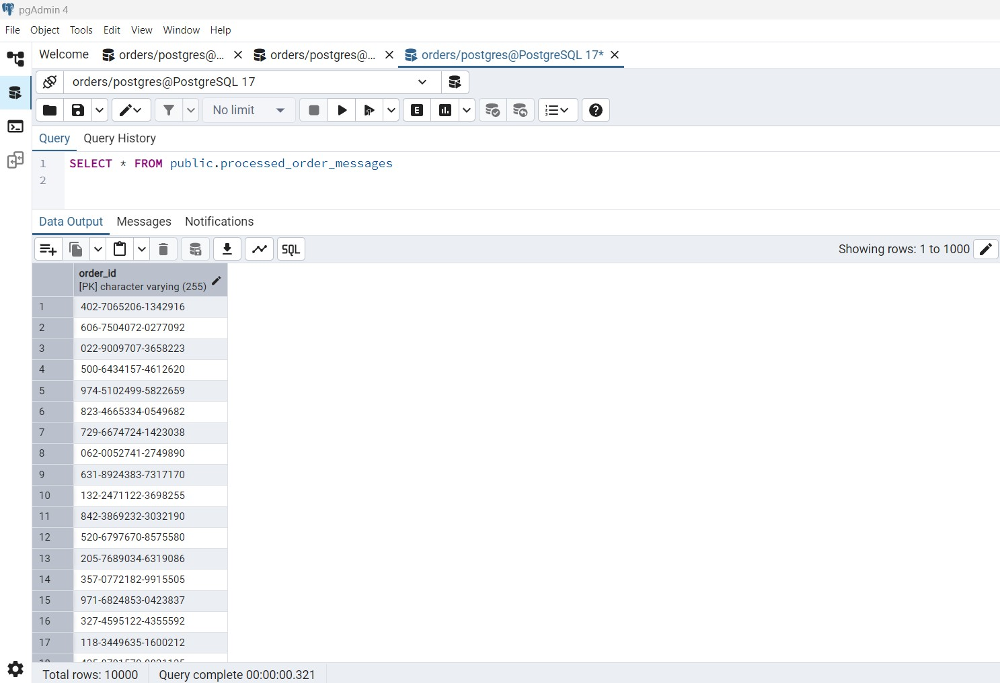

# Kafka Idempotent Consumer

## Project :


## Project Dependencies :
```xml
<dependencies>

        <dependency>
            <groupId>org.apache.kafka</groupId>
            <artifactId>kafka-clients</artifactId>
            <version>3.6.0</version>
        </dependency>

        <dependency>
            <groupId>org.postgresql</groupId>
            <artifactId>postgresql</artifactId>
            <version>42.7.5</version>
        </dependency>

        <dependency>
            <groupId>com.fasterxml.jackson.core</groupId>
            <artifactId>jackson-databind</artifactId>
            <version>2.18.2</version>
        </dependency>

        <dependency>
            <groupId>com.fasterxml.jackson.datatype</groupId>
            <artifactId>jackson-datatype-jsr310</artifactId>
            <version>2.16.0</version>
        </dependency>

    </dependencies>
```

## orders-topic :


## processed_order_messages table :



